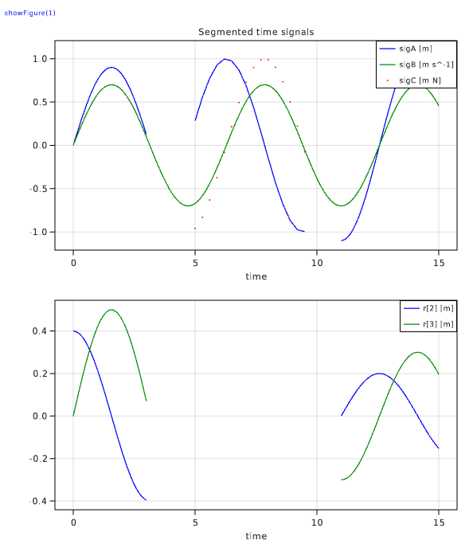

# ModiaPlot_WGLMakie

[](https://modiasim.github.io/ModiaResult.jl/stable/index.html)
[](https://github.com/ModiaSim/ModiaResult.jl/blob/master/LICENSE.md)

ModiaPlot_WGLMakie is part of [ModiaSim](https://modiasim.github.io/docs/)
and provides convenient line plots of simulation results with package
[WGLMakie](https://github.com/JuliaPlots/WGLMakie.jl).

ModiaPlot_WGLMakie is typically not directly used, but is activated via package
[ModiaResult](https://github.com/ModiaSim/ModiaResult.jl).
For details of the installation and the usage, 
see the [ModiaResult documentation](https://modiasim.github.io/ModiaResult.jl/stable/index.html).


## Example

Once a result data structure `result` with signals `sigA(t), sigB(t), sigC(t), r[3](t)`:

```julia
 # │ name  unit    nTime  signalType  valueSize  eltype          
───┼─────────────────────────────────────────────────────────────
 1 │ time          2      TimeSignal  ()         Float64
 2 │ sigA  m       88     Continuous  ()         Float64
 3 │ sigB  m s^-1  151    Continuous  ()         Float64
 4 │ sigC  m N     16     Clocked     ()         Float64
 5 │ r     m       72     Continuous  (3,)       Vector{Float64}
 ```
 
is available and `WGLMakie` selected for plotting, 

```julia
import ModiaResult

# Define plotting software globally
ModiaResult.activate("WGLMakie") # or ENV["MODIA_PLOT"] = "WGLMakie"
                
# Execute "using ModiaPlot_WGLMakie"                              
ModiaResult.@usingModiaPlot
```

generates the following image (layout and legends are automatically constructed):




## Main developer

[Martin Otter](https://rmc.dlr.de/sr/en/staff/martin.otter/),
[DLR - Institute of System Dynamics and Control](https://www.dlr.de/sr/en)
